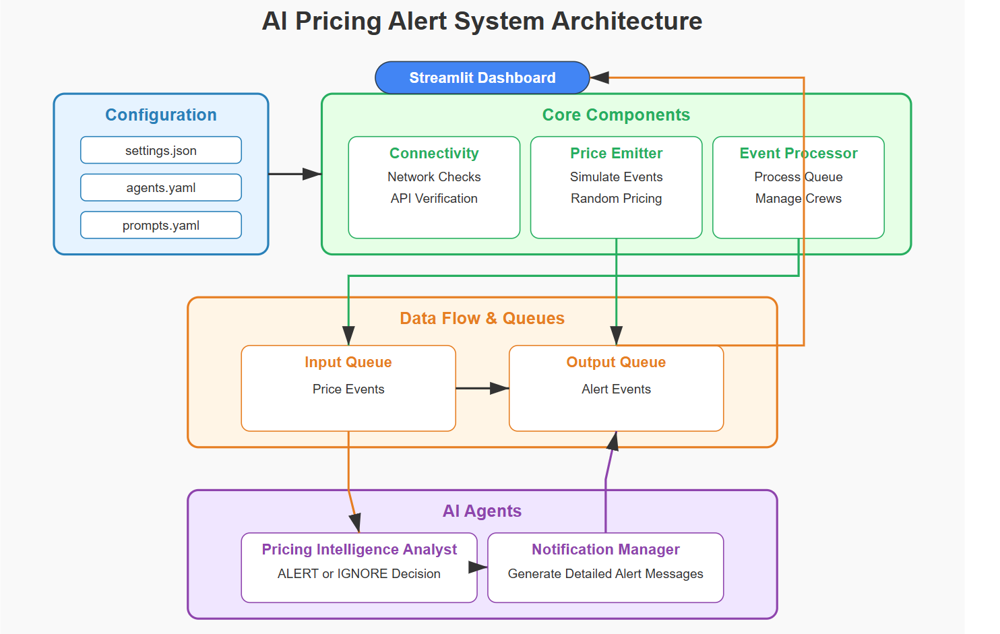

# **Let's Build AI Agent System For Real-Time Event-Driven Pricing Alert Pipeline**

Hands-on: Building an AI-Powered Real-Time Pricing Alert Pipeline for E-Commerce

## TL;DR
This article demonstrates how to build and implement a real-time event-driven pricing alert pipeline powered by AI agents. The system monitors competitors’ prices across product categories like electronics, appliances, and smart home devices, then analyzes the data to trigger alerts when significant price discrepancies occur. Using a stack that includes Python, Streamlit, CrewAI, and LangChain, the pipeline enables businesses to respond quickly to market changes and maintain competitiveness in the dynamic e-commerce landscape

## Introduction:
In today’s hypercompetitive e-commerce environment, pricing strategy can make or break a business. Companies need to stay informed about competitors’ pricing in real-time to remain competitive and protect their market share. However, manually monitoring prices across multiple products and competitors is time-consuming and error-prone.

Automated pricing intelligence tools have become essential for modern e-commerce operations, but many existing solutions lack the nuanced decision-making capabilities that businesses need. This is where AI comes in — specifically, the ability to analyze pricing events contextually and generate targeted, actionable notifications.

This article explores a sophisticated real-time pricing alert system that leverages AI agents to monitor market conditions, analyze pricing events, and deliver strategic recommendations to sales and product teams.

## What’s This Article About?
This article provides a comprehensive walkthrough of an AI-powered pricing intelligence system that:

- Continuously monitors product pricing against competitors
- Uses intelligent agents to analyze pricing disparities
- Makes context-aware decisions about when to alert teams
- Generates detailed, actionable notifications with strategic recommendations
- Presents the information through an intuitive real-time dashboard

We’ll explore the system architecture, decision-making process, implementation details, and real-world applications. By the end, you’ll understand how to build a similar system for your own e-commerce operations.

Full Article : [https://medium.com/@learn-simplified/lets-build-ai-agent-system-for-real-time-event-driven-pricing-alert-pipeline-b484465be730


## Architecture




# Tutorial: Let's Build AI Agent System For Real-Time Event-Driven Pricing Alert Pipeline

## Prerequisites
- Python installed on your system.
- A basic understanding of virtual environments and command-line tools.

## Steps

1. **Virtual Environment Setup:**
   - Create a dedicated virtual environment for our project:
   
     ```bash
     python -m venv Real-Time-Event-Driven-Pricing-Alert-Pipeline
     ```
   - Activate the environment:
   
     - Windows:
       ```bash
          Real-Time-Event-Driven-Pricing-Alert-Pipeline\Scripts\activate        
       ```
     - Unix/macOS:
       ```bash
       source Real-Time-Event-Driven-Pricing-Alert-Pipeline/bin/activate
       ```
   

# Installation and Setup Guide

**Install Project Dependencies:**

Follow these steps to set up and run the  "Let's Build AI Agent System For Real-Time Event-Driven Pricing Alert Pipeline"

1. Navigate to your project directory:
   ```
   cd path/to/your/project
   ```
   This ensures you're in the correct location for the subsequent steps.

2. Install the required dependencies:
   ```
   pip install -r requirements.txt   
   ```
   This command installs all the necessary Python packages listed in the requirements.txt file.


# Run - Hands-On Guide: Let's Build AI Agent System For Real-Time Event-Driven Pricing Alert Pipeline
  
   ```

   streamlit run main.py
   
   ```
   
## Closing Thoughts

Creating this system required balancing technical complexity with practical business needs. The modular design makes it easy to extend — perhaps adding real competitor data sources instead of simulations, or expanding the AI analysis to include more nuanced pricing strategies. The event-driven architecture with queues ensures the system remains responsive even under load.

While this implementation focuses on e-commerce pricing, the pattern could be adapted for any domain requiring real-time monitoring and AI-powered decision making, from financial trading to infrastructure monitoring.